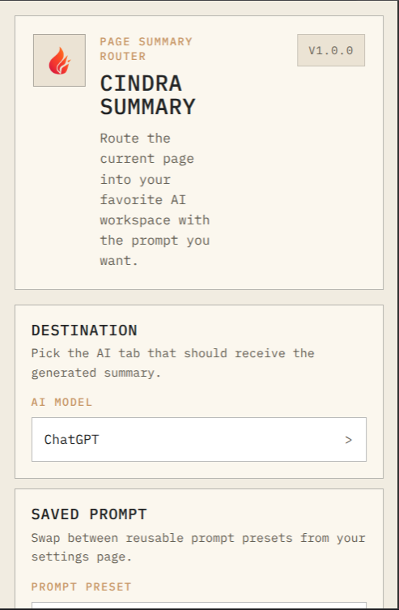
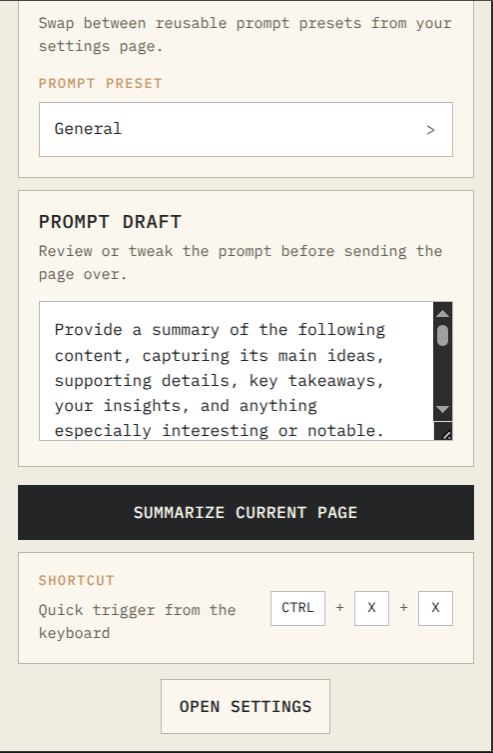
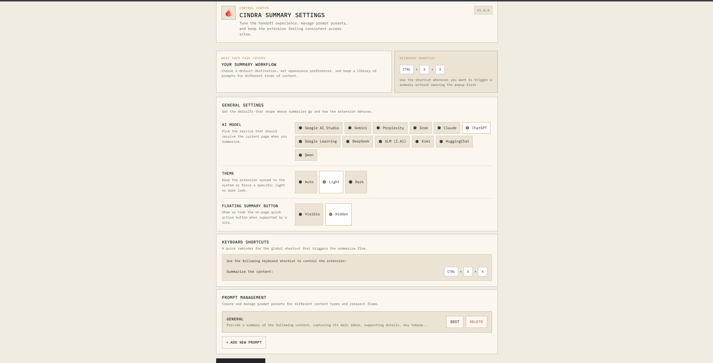
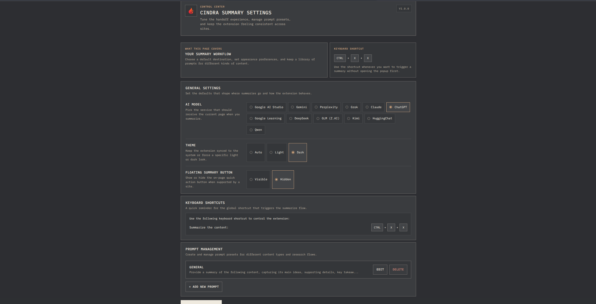

[](https://deepwiki.com/feveromo/cindra)

# Cindra Summary

Cindra Summary is a Chrome extension that sends the current page, YouTube transcript, or Reddit thread to your preferred AI chat for summarization.

## What it does

- Summarizes the current page from the popup
- Supports a keyboard shortcut: `Ctrl + X + X`
- Can show a floating summarize button on regular webpages
- Stores reusable prompt presets
- Can send the full page or only selected text
- Opens an optional on-page composer when you highlight text so you can ask a question about that exact selection
- Shows handoff status with copy/resend recovery for the last generated prompt
- Lets you clear or disable saved prompt handoff history
- Routes content into multiple AI destinations without using an API key directly

## Screenshots

### Toolbar popup

<p align="center">
  
  
</p>

### Settings page

<p align="center">
  
  
</p>

## Supported destinations

- Google AI Studio
- Gemini
- Perplexity
- Grok
- Claude
- ChatGPT
- Google Learning
- DeepSeek
- GLM (Z.AI)
- Kimi
- HuggingChat
- Qwen

## Content sources

- Regular webpages
- Selected text from the current page
- YouTube videos with transcript extraction
- Reddit threads and posts

## Known limitations

- PDF extraction is not implemented yet
- Very long pages may be trimmed in the middle to stay within browser and provider limits
- Provider integrations depend on each site's live DOM, so breakage can happen when those UIs change

## Installation

1. Clone the repository:

```bash
git clone https://github.com/feveromo/cindra.git
cd cindra
```

2. Open `chrome://extensions/`
3. Enable Developer Mode
4. Click `Load unpacked`
5. Select this repository folder

## Usage

1. Open the extension popup
2. Pick a destination AI service
3. Pick or edit a prompt preset
4. Pick the content source if you want selected text or page text specifically
5. Click `Summarize Current Page`

You can also use `Ctrl + X + X` on a page, the floating button if it is enabled in settings, or highlight text and use the on-page composer to ask a focused question.

## Project structure

```text
cindra/
├── background/          # MV3 service worker and routing logic
├── content_scripts/     # Site-specific integrations and generic page shortcut UI
├── lib/                 # Shared provider/source registry
├── images/              # Extension icons
├── ui/
│   ├── options/         # Settings page
│   └── popup/           # Popup UI
└── manifest.json
```

## Adding a provider

1. Add a content script in `content_scripts/`
2. Register it in `manifest.json`
3. Add the provider metadata to `lib/providers.js`
4. Add any provider-specific insertion logic to the content script

## License

MIT. See [LICENSE](LICENSE).
