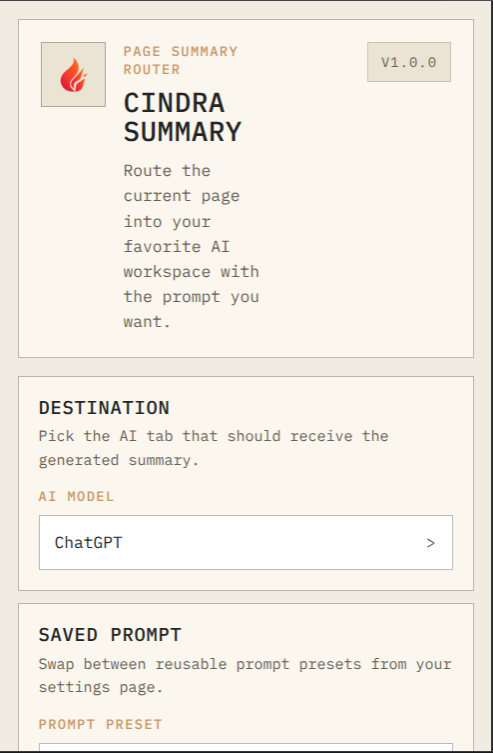
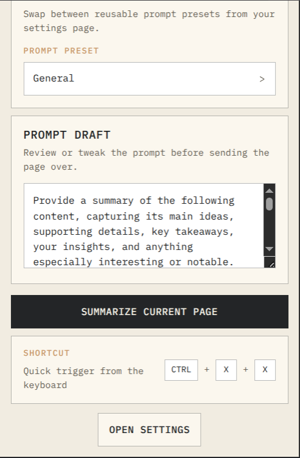
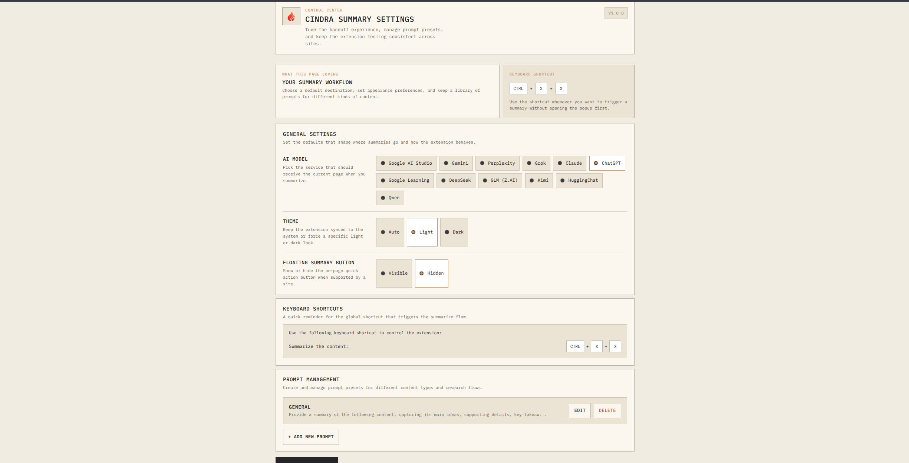
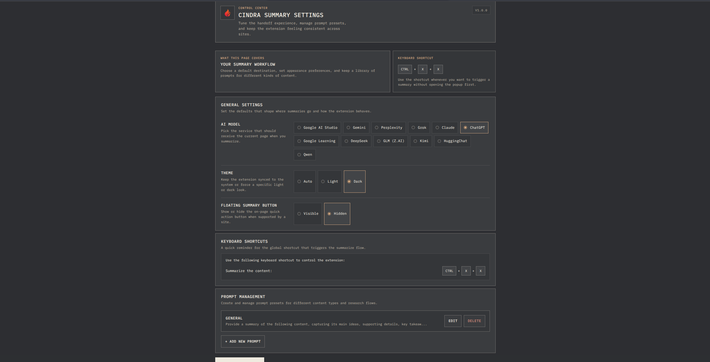

[](https://deepwiki.com/feveromo/cindra)

# Cindra Summary

Cindra Summary is a Manifest V3 Chrome extension that extracts the current page, selected text, PDF text, a YouTube transcript, or a Reddit thread and routes it to a selected AI chat workspace. It uses the destination’s existing web UI, so no API key is required.

## Highlights

- Popup routing to 13 AI destinations
- `Ctrl + X + X` page shortcut
- Accessible floating summarize button
- Selection composer for focused questions about highlighted text
- Reusable prompt presets and per-handoff prompt editing
- Page, selection, PDF, YouTube, and Reddit extraction
- Copy/resend recovery for recent generated prompts
- Optional local prompt history with one-click clearing
- Bounded long-page extraction that preserves the beginning and end
- Serialized, isolated PDF parsing with vendored PDF.js
- Expiring local YouTube transcript cache
- Deterministic unit and unpacked-extension browser tests

## Screenshots

### Toolbar popup

<p align="center">
  
  
</p>

### Settings page

<p align="center">
  
  
</p>

## Supported destinations

- Google AI Studio
- Gemini
- Perplexity
- Grok
- Claude
- ChatGPT
- Google Learning
- DeepSeek
- GLM (Z.AI)
- Kimi
- HuggingChat
- Qwen
- Cerebras

Provider metadata, match patterns, limits, and storage keys are defined in `lib/providers.js`.

## Content sources

- **Best Available**: automatically chooses a specialized source when supported
- **Page Text**: extracts the largest readable page region and removes surrounding controls
- **Selected Text**: uses the active browser selection
- **PDF Text**: extracts selectable PDF text or parses the current HTTP(S) PDF with PDF.js
- **YouTube**: extracts a genuine caption transcript and rejects manual-instruction fallback text
- **Reddit**: extracts post/comment structure and falls back to readable page text

Very long page captures are limited to 500,000 characters. Cindra preserves the beginning and end and inserts an omission notice. Each destination can apply a stricter final prompt limit.

## Installation

```bash
git clone https://github.com/feveromo/cindra.git
cd cindra
pnpm install
```

Then:

1. Open `chrome://extensions/`.
2. Enable **Developer mode**.
3. Choose **Load unpacked**.
4. Select the repository directory.

## Usage

1. Open the popup.
2. Select an AI destination and content source.
3. Select a prompt preset and optionally adjust the draft.
4. Choose **Summarize Current Page**.

On supported pages, you can also use `Ctrl + X + X`, the floating button, or highlight text to open the selection composer.

## Privacy and local data

Cindra does not send content to a Cindra-operated server. Extracted content is delivered only to the AI destination selected by the user.

- Workflow preferences and prompt presets use `chrome.storage.sync`.
- Pending handoffs, status, transcript cache, and optional recent generated prompts use `chrome.storage.local`.
- Recent prompt history keeps at most five entries and can be disabled or cleared in Settings.
- YouTube transcript cache entries expire after seven days and are capped at 20 entries.
- PDF downloads accept only HTTP(S), enforce a 50 MiB limit, validate the PDF signature, and disable PDF.js JavaScript evaluation.

Chrome requests access to HTTP and HTTPS pages because Cindra’s shortcut and optional page controls run there and because explicit summary actions need to read the selected source.

## Known limitations

- Scanned image-only PDFs require OCR before Cindra can summarize their text.
- Provider automation depends on live destination DOMs and may need maintenance when those sites redesign their composers.
- Some providers enforce small input limits, so Cindra may trim the final content more aggressively for those destinations.
- Protected pages and Chrome-internal URLs do not allow normal content-script extraction.

## Project structure

```text
cindra/
├── background/
│   ├── background.js          # MV3 service-worker wiring and trusted message entry point
│   ├── orchestrator.js        # normalize → route → extract → format → handoff pipeline
│   ├── handoffs.js            # destination opening, pending envelopes, status, recovery
│   ├── pdf.js                 # serialized offscreen and tab PDF extraction
│   └── transcript-cache.js    # expiring LRU YouTube transcript cache
├── content_scripts/
│   ├── *_content.js           # provider, YouTube, and Reddit adapters
│   └── lib/
│       ├── inject.js          # shared DOM input/click helpers
│       ├── provider_runtime.js
│       ├── page_ui.js         # floating button and selection composer
│       ├── youtube_ui.js      # lifecycle-managed YouTube transcript control
│       └── youtube_parser.js
├── lib/
│   ├── chrome.js              # Promise wrappers for Chrome APIs
│   ├── errors.js              # contextual diagnostics and safe user messages
│   ├── extraction.js          # shared page/selection/PDF DOM extraction
│   ├── messages.js            # action constants, validation, messaging timeouts
│   ├── prompt.js
│   ├── providers.js
│   └── pdf.js
├── offscreen/                 # isolated PDF.js document
├── ui/                        # popup, settings, shared theme and styles
├── tests/                     # Node unit tests and Playwright extension fixtures
├── vendor/pdfjs/              # pinned PDF.js runtime and Apache 2.0 license
├── ARCHITECTURE.md
├── CHANGELOG.md
└── manifest.json
```

See [`ARCHITECTURE.md`](ARCHITECTURE.md) for runtime boundaries, message flow, cache behavior, storage, and handoff details.

## Development

```bash
pnpm check
pnpm test:unit
pnpm test:extension
# or run both suites
pnpm test
```

- `pnpm check` validates JavaScript syntax, version synchronization, provider registry invariants, and manifest/HTML references.
- `pnpm test:unit` covers routing, extraction, messages, errors, caches, UI helpers, prompt limits, PDF validation, and YouTube parsing.
- `pnpm test:extension` loads the unpacked extension against deterministic local fixtures. It does not probe or monitor live AI sites.

## Adding a provider

1. Add provider metadata to `lib/providers.js`, including `contentScript.matches`, `contentScript.file`, target URL, storage keys, and any content limit.
2. Add one manifest block that loads, in order:
   - `lib/errors.js`
   - `lib/chrome.js`
   - `lib/messages.js`
   - `content_scripts/lib/inject.js`
   - `content_scripts/lib/provider_runtime.js`
   - the provider adapter
3. Implement only destination-specific input/submit behavior in `content_scripts/<provider>_content.js` and register it with `CindraProviderRuntime.registerAdapter()`.
4. Add deterministic unit or Playwright coverage and run all validation commands.

## License

MIT. See [`LICENSE`](LICENSE). Vendored PDF.js licensing is retained in `vendor/pdfjs/LICENSE`.
