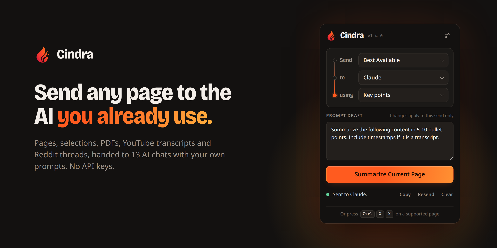
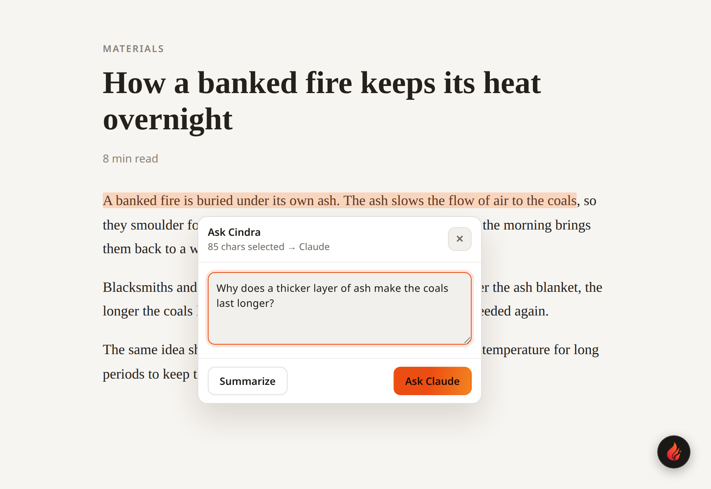
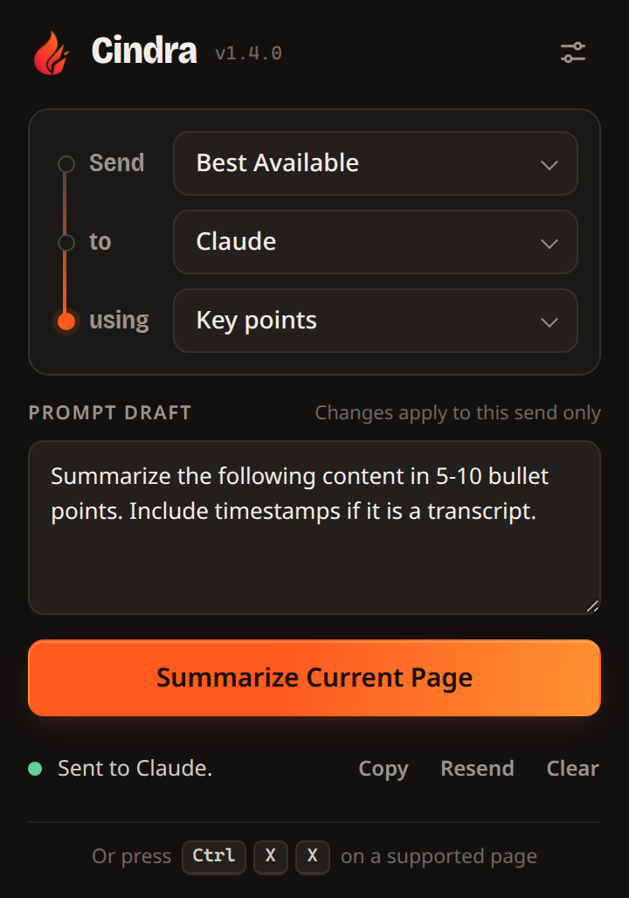
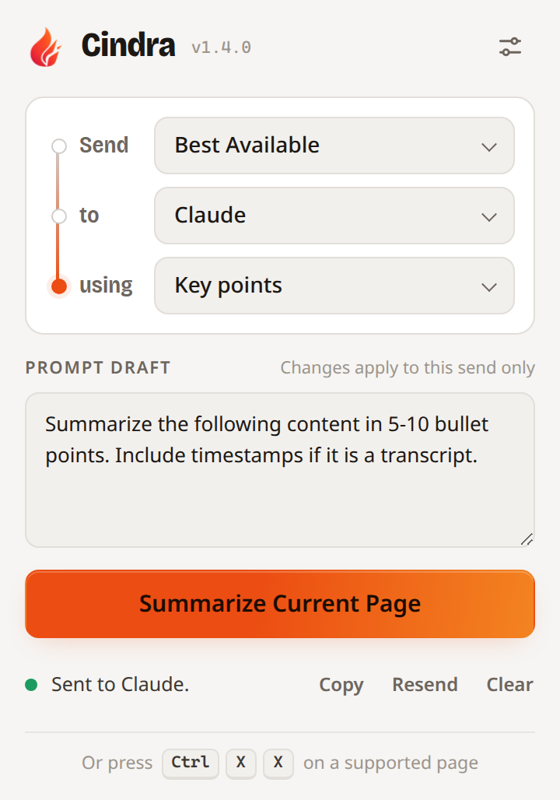
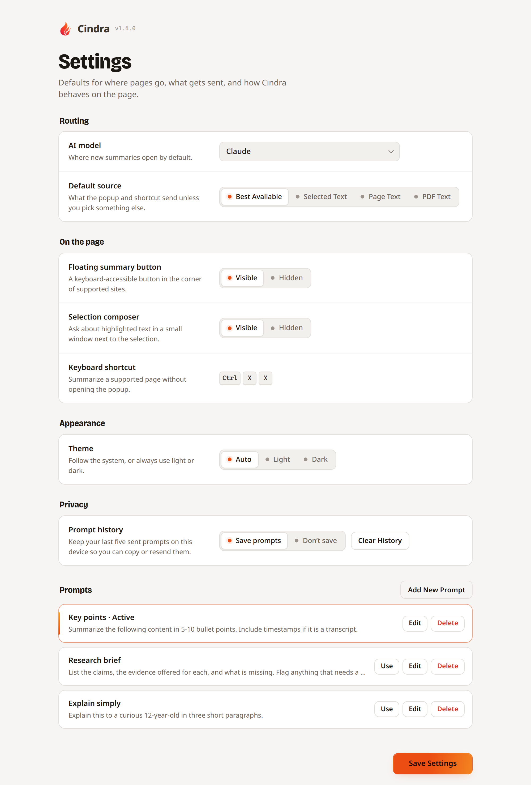
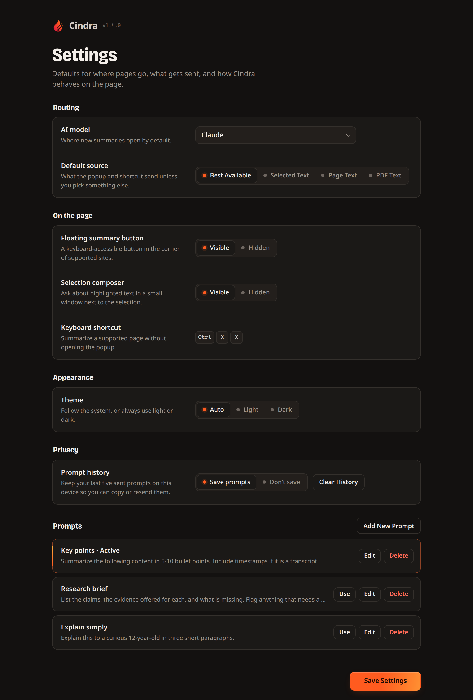

<p align="center">
  
</p>

Cindra is a Chrome extension that sends the page you're reading to an AI chat, together with a prompt you choose. It works with the AI's normal website, signed in as you, so there are no API keys to set up and nothing goes through a Cindra server.

It can send a whole page, the text you've selected, a PDF, a YouTube video's transcript or a Reddit thread to 13 AI chats.

<p align="center">
  <a href="https://deepwiki.com/feveromo/cindra"></a>
</p>

## Three ways to send

**The popup.** Pick what to send, which AI gets it and which prompt to use, edit the prompt if you like, then press **Summarize Current Page**. Cindra opens the AI site in a tab, pastes the prompt and the content, and sends it.

**The shortcut.** Hold `Ctrl` and press `X` twice on any page to send it with your default settings. The shortcut is ignored while you're typing in a text field.

**The selection composer.** Highlight some text and a small window appears next to it. Ask a question about the selection, or summarize just that part.

<p align="center">
  
</p>

## What it can send

Choose a source in the popup, or set a default in settings.

| Source | What Cindra sends |
| --- | --- |
| Best Available | The default. Picks the right content for the page you're on (see below). |
| Page Text | The main readable part of the page, without menus, forms and sidebars. |
| Selected Text | Whatever you've highlighted. |
| PDF Text | The text of the PDF you're viewing, read with a bundled copy of PDF.js. |

With Best Available, Cindra recognises a few kinds of page:

| On | It sends |
| --- | --- |
| A YouTube video | The full caption transcript, with the title, channel and description. Cindra checks that the transcript belongs to the video you're watching. |
| A Reddit thread | The post, then each comment with its author's name. |
| A PDF | The PDF's text. |
| Anything else | The page text. |

Very long pages are cut to 500,000 characters, keeping the beginning and the end. Some AI sites accept less than that, so Cindra trims further for those.

## Where it can send

Google AI Studio, Meta AI Playground, Gemini, Perplexity, Grok, Claude, ChatGPT, Google Learning, GLM (Z.AI), Kimi, HuggingChat, Qwen and Cerebras.

You need to be signed in to the AI site in the same browser. Meta AI Playground selects the Muse Spark 1.2 Contributor model for each send.

## Install

Cindra isn't on the Chrome Web Store, so you load it from this repository. There's no build step.

1. Clone the repository: `git clone https://github.com/feveromo/cindra.git`
2. Open `chrome://extensions` and turn on **Developer mode**.
3. Choose **Load unpacked** and select the `cindra` folder.
4. Pin Cindra to the toolbar.

To update, run `git pull` and press the reload button on Cindra's card in `chrome://extensions`. Cindra needs Chrome 125 or later.

## Popup and settings

<p align="center">
  
  &nbsp;
  
</p>

Open settings from the slider icon in the popup.

| Setting | What it does |
| --- | --- |
| AI model | Where new summaries go by default. |
| Default source | What the popup and shortcut send unless you choose otherwise. |
| Floating summary button | A small flame button in the corner of most web pages. On by default. |
| Selection composer | The window that appears when you highlight text. On by default. |
| Theme | Follow your system, or always use light or dark. |
| Prompt history | Keeps your last five sent prompts so you can copy or resend them. |
| Prompts | Create, edit and delete reusable prompts, and choose the active one. |

<p align="center">
  
  
</p>

## Privacy

Cindra has no server and no analytics. The content you send goes only to the AI site you picked.

- Your settings and prompts are stored with `chrome.storage.sync`, so Chrome syncs them if you've turned on sync.
- Recent prompts, the status of the last send and cached YouTube transcripts stay on your device in `chrome.storage.local`.
- Prompt history holds at most five entries. You can turn it off or clear it in settings.
- Cached transcripts expire after seven days, and at most 20 are kept.
- PDFs are only downloaded over HTTP(S), up to 50 MiB, and PDF.js runs with scripting turned off.

Chrome asks for access to all websites because the shortcut, the floating button and the selection composer run on every page, and because Cindra has to read a page to send it.

## Known limitations

- Scanned PDFs that are only images have no text to send. Run them through OCR first.
- Cindra fills in each AI site's message box the way you would. When a site redesigns that box, its adapter may need an update.
- Chrome doesn't let extensions read its own pages (`chrome://`) or the Chrome Web Store.

## Development

```bash
pnpm install
pnpm check            # syntax, manifest and HTML references, provider registry
pnpm test:unit        # Node unit tests
pnpm test:extension   # loads the unpacked extension in Playwright against local fixtures
pnpm test             # both test suites
```

The browser tests use local stand-ins for every site and never contact the real AI services.

[`ARCHITECTURE.md`](ARCHITECTURE.md) explains how the pieces fit together: the background worker, content scripts, message validation, the handoff to each AI site, caching and storage.

```text
background/        service worker: routing, extraction, handoffs, PDF and transcript cache
content_scripts/   one adapter per AI site, plus YouTube, Reddit and on-page controls
lib/               shared code: provider registry, messages, prompts, extraction
offscreen/         isolated document for reading PDFs
ui/                popup, settings, error page, theme and fonts
tests/             unit tests and Playwright extension tests
vendor/pdfjs/      pinned PDF.js
```

### Adding an AI site

1. Add the site to `lib/providers.js`: its URL, which pages the adapter runs on, its storage key and any length limit.
2. Add a `content_scripts` entry to `manifest.json` that loads, in this order: `lib/errors.js`, `lib/chrome.js`, `lib/messages.js`, `content_scripts/lib/inject.js`, `content_scripts/lib/provider_runtime.js`, then your adapter.
3. Write `content_scripts/<site>_content.js`. It only needs to find the message box and send button, then register itself with `CindraProviderRuntime.registerAdapter()`.
4. Add a test, then run `pnpm check` and `pnpm test`.

## License

MIT, see [`LICENSE`](LICENSE). PDF.js is under the Apache 2.0 license (`vendor/pdfjs/LICENSE`). The Bricolage Grotesque font is under the SIL Open Font License (`ui/fonts/OFL.txt`).
